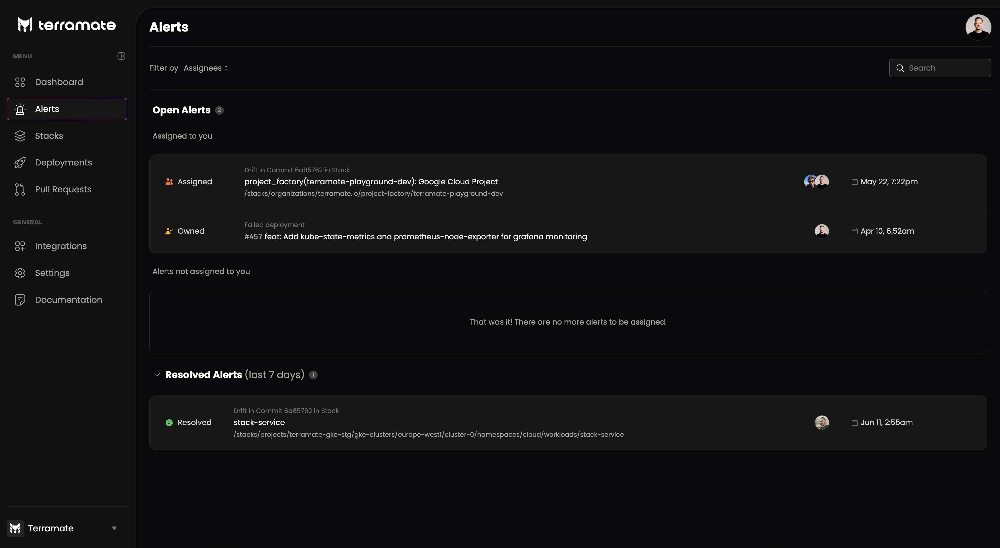

# Managing Incidents with Alerts

Alerts in Terramate Cloud help manage attention-demanding events such as ***failed deployments*** or ***detected drift***.

Terramate automatically creates alerts for those events and assigns them to the right individuals and teams, such as the
author of a commit or Pull Request.

Alerts also integrate well with Slack via the [Slack App](../integrations/slack.md)
integration, which sends direct messages to individuals and teams assigned to alerts whenever alerts are created or updated.

::: Warning
Unless a member of your Terramate Cloud organization uses the same email address among all their third-party accounts
(e.g., GitHub user, GitLab user, Slack user, etc.), users must link their accounts with their Terramate Cloud user in the
profile section. Otherwise, Terramate cannot automatically assign alerts because of the lack of mapping, e.g., for
GitHub and Slack users.

Linking accounts can be done in the profile section
:::

## Types of Alerts

Currently, Terramate Cloud automatically creates, assigns and resolves alerts for the following incidents:

### Failed Deployment

A failed deployment in Terramate describes a deployment that contains one or multiple failed stacks.
Alerts for failed deployments will be automatically assigned to several individuals:

- Author of the Pull Requests from which the failed deployment originated.
- All reviewers of the Pull Requests from which the failed deployment originated.
- The person who triggered the deployment by merging the origin Pull Requests or triggering a local deployment.

### Unhealthy Deployment

An unhealthy deployment in Terramate describes a deployment that has a failed health check.
Alerts for unhealthy deployments will be automatically assigned to several individuals:

- Author of the Pull Requests from which the failed deployment originated.
- All reviewers of the Pull Requests from which the failed deployment originated.
- The person who triggered the deployment by merging the origin Pull Requests or triggering a local deployment.

### Detected Drift

A detected drift in Terramate describes a stack that has drifted.
Alerts for drifted stacks will be automatically assigned to several individuals:

- The person who triggered the last deployment (merging the latest Pull Requests or triggering a local deployment).

## Manually assigning Alerts

In addition to the auto assignees, alerts can be manually assigned and unassigned to and from any user in your
Terramate Cloud organization in the details view of an alert.

## Resolving Alerts

Alerts are automatically marked as resolved whenever all stacks included in an alert are marked as healthy.
Stacks can be marked as healthy by running scheduled drift detection workflows or successful deployments.

Additionally, you can manually resolve alerts in the detail view of an alert by hitting the ***Resolve Alert*** button.

## Integrating Alerts with Slack

To integrate alerts with your Slack workspace, [install the Slack App](../integrations/slack.md). Once installed, the
Slack App will send notifications for all newly created and updated alerts to all assigned users. Users will be able to
open alerts and affected stacks directly from Slack.

