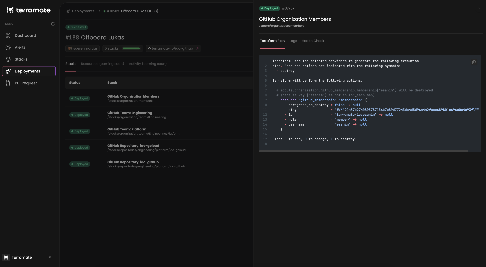

# Deployments

This section explains **deployments** as a core concept in Terramate.

::: info
To associate deployments triggered on GitHub Actions, GitLab CI/CD, or other CI/CD platforms with your Terramate Cloud user, connect these platforms to your Terramate Cloud account. Learn to link your accounts in the [account linking](../profile/account-linking.md) documentation.
:::

## Introduction

Deployments in the context of Infrastructure as Code (IaC) are a process that groups various activities to provision
and decommission infrastructure resources that are defined in code to the cloud or other providers.

Terramate Cloud keeps track of all activities related to the full deployment life-cycle, the outcome of such activities,
notifies and alerts about anomalies and failures, and provides full audibility (search, filter, browse) of historic
changes.

Terramate CLI orchestrates all related activities (such as `terraform apply`) and synchronizes details to
Terramate Cloud from various sources (e.g. multiple stacks, repositories, or CI/CD environments - even manual execution)
and over multiple technologies (e.g. Terraform, OpenTofu, CloudFormation, Pulumi) and for multiple providers
(e.g. AWS, Google Cloud, Azure).

